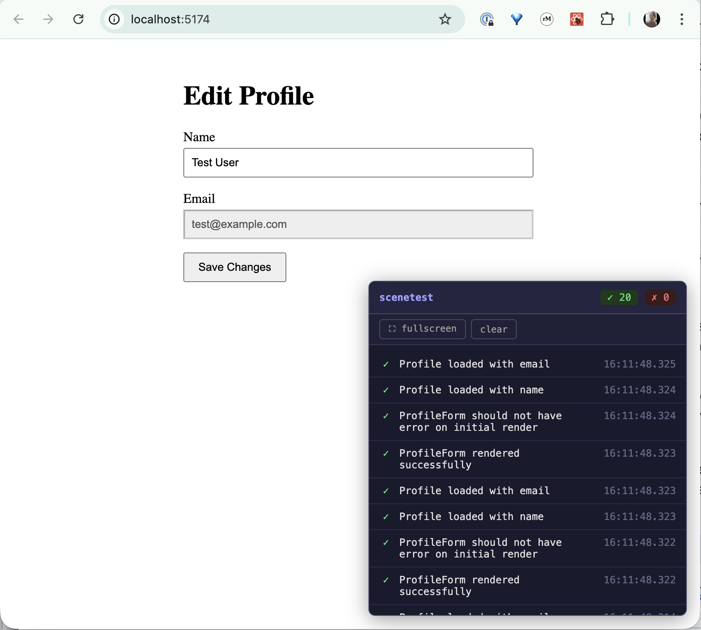

# Scenetest

_Evaluate your product, not your tests. Write friendly little Scenes for your Actors. A Javascript Testing framework inspired by Playwright's `page.evaluate`_ and React server actions.

---

## Usage

### Installation

```bash
pnpm install scenetest vite-plugin-scenetest playwright-scenetest
```

### 1. Add the Vite Plugin

```typescript
// vite.config.ts
import { defineConfig } from 'vite'
import react from '@vitejs/plugin-react'
import scenetest from 'vite-plugin-scenetest'

export default defineConfig({
  plugins: [react(), scenetest()],
})
```

The plugin automatically strips all scenetest code from production builds.

In development mode, a floating panel appears in your app showing assertions in real-time.

### 2. Write Inline Assertions in Your Components

```tsx
// src/components/ProfileForm.tsx
import { useState } from 'react'
import { should, failed } from 'scenetest'

export function ProfileForm({ user }) {
  const [name, setName] = useState(user.name)

  // These assertions run every render in dev/test mode
  should('user should be available', user !== undefined)

  // Use failed() as an escape hatch for unexpected states
  if (user?.error) {
    failed('user in unexpected error state', { error: user.error })
  }

  return (
    <form>
      <input value={name} onChange={e => setName(e.target.value)} />
    </form>
  )
}
```

### 3. Multi-Context Assertions with `useAssert`

For assertions that need to compare browser data with server data:

```tsx
// src/components/ProfileForm.tsx
import { useAssert, should } from 'scenetest'

export function ProfileForm({ userId }) {
  const { profile, isLoading } = useProfile(userId)

  // Runs when deps change, compares browser and server data
  useAssert({
    title: 'Profile matches database',
    withData: () => ({
      localProfile: profilesCollection.get(userId),
      state: profile,
    }),
    serverFn: async (server, data) => {
      const dbProfile = await server.db.get(userId)
      should('DB should match local', dbProfile.name === data.localProfile.name)
      should('user id should match', userId === dbProfile.user_id)
    },
    enabled: !isLoading,
  }, [isLoading, profile?.id])

  return <form>{/* ... */}</form>
}
```

Configure server functions in `scenetest.config.ts`:

```typescript
// scenetest.config.ts
import { defineScenetestConfig } from 'vite-plugin-scenetest'

export default defineScenetestConfig({
  serverFunctions: {
    validateEmail: (email) => /^[^\s@]+@[^\s@]+\.[^\s@]+$/.test(email),
    getUser: (id) => db.users.findById(id),
  },
	/* not here yet
	fnInjection: async (data, req, headers) =>
})
```

### 4. Orchestrate However You Want

Scenetest doesn't care how you drive your app. The assertions fire whenever the code runs. Use whatever works for you:

- **Playwright** - automated browser testing
- **Cypress** - another great automation tool
- **AI agents** - let an LLM click around your app
- **Human testers** - QA team exploring edge cases
- **You, the developer** - just use your app normally
- **Your cat walking on the keyboard** - valid test input
- **Improv sessions** - "yes, and... what if I click this?"

The `playwright-scenetest` package provides a convenient `scenePage` fixture, but it's just one option. Any tool that can drive a browser will trigger your inline assertions.

### 5. Write Scenes with Playwright (Optional)

```typescript
// tests/profile.scene.ts
import { test, expect } from 'playwright-scenetest'

test('User updates their profile', async ({ scenePage }) => {
  await scenePage.goto('/profile')

  // Interact with the app
  await scenePage.getByLabel('Name').fill('New Name')
  await scenePage.getByRole('button', { name: 'Save' }).click()

  // Check inline assertions were collected
  console.log(`Collected ${scenePage.assertions.length} assertions`)

  // All assertions should have passed
  expect(scenePage.failed).toHaveLength(0)

  // Check specific assertions ran
  const userAvailable = scenePage.assertions.find(
    a => a.description === 'user object is available'
  )
  expect(userAvailable?.result).toBe(true)
})
```

**Playwright Config:**

```typescript
// playwright.config.ts
import { defineConfig } from '@playwright/test'

export default defineConfig({
  testDir: './tests',
  testMatch: '**/*.scene.ts',
  use: {
    baseURL: 'http://localhost:5173',
  },
  webServer: {
    command: 'npm run dev',
    url: 'http://localhost:5173',
  },
})
```

**Run Your Scenes:**

```bash
# Start dev server and run tests
npx playwright test

# Example output:
# Collected 37 inline assertions:
#   - Passed: 37
#   - Failed: 0
```

### Dev Panel

When running your app in development mode (`pnpm run dev`), Scenetest injects a floating panel that shows inline assertions in real-time as you interact with your app.



**Features:**
- **Live assertion feed**: See `should()` and `failed()` results as they fire
- **Pass/fail counts**: Quick summary of assertion results
- **Collapsible**: Click the header to minimize
- **Fullscreen mode**: Click the fullscreen button to open assertions in a dedicated window with stack traces
- **Clear button**: Reset assertions to start fresh

This lets you validate assertions without running Playwright tests - just click around your app and watch the assertions fire.

**Configuration:**
```typescript
// Disable the dev panel
scenetest({ devPanel: false })

// Force-enable in test mode (normally disabled for Playwright)
scenetest({ devPanel: true })
```

### API Reference

#### `should(description, condition, context?)`
Records an assertion. Passes when `condition` is truthy, fails when falsy. Optional `context` object for debugging. Description should read as a natural "should" statement.

```tsx
should('user should be logged in', user !== null)
should('form should have valid email', isValidEmail(email), { email })
```

#### `failed(description, context?)`
Unconditional failure marker for unexpected code paths. Use this past-tense helper to indicate something bad already happened—there's no more checking to do.

```tsx
if (error) {
  failed('unexpected error during save', { error: error.message })
  return
}

mutation.mutate(data, {
  onError: (err) => failed('mutation failed', { error: err })
})
```

#### `useAssert(config, deps)`
React hook for multi-context assertions. Same config shape as `assert()`. Use `enabled: false` to skip.

```tsx
useAssert({
  title: 'Profile matches database',
  withData: () => ({ userId: profile.id }),
  serverFn: async (server, data) => {
    const dbProfile = await server.db.get(data.userId)
    should('DB should match local', dbProfile.name === data.local.name)
  },
  enabled: !isLoading,
}, [isLoading, profile?.id])
```

#### `assert(config)`
Imperative multi-context assertion for use in callbacks (e.g., `onSuccess`, `onSettled`).

```tsx
onSuccess: (data) => {
  assert({
    title: 'Data saved correctly',
    withData: () => ({ id: data.id }),
    serverFn: (server, data) => {
      const dbRecord = server.db.get(data.id)
      should('record should exist', dbRecord !== null)
    },
  })
}
```

#### `match(...pairs)`
Compare pairs of values for equality. Returns `true` if all pairs match.

```tsx
should('primary fields should match', match(
  [localDeck.cards, dbDeck.cards],
  [localDeck.updated_at, dbDeck.updated_at]
))
```

#### `scenePage` fixture
Extended Playwright `page` with:
- `scenePage.assertions` - All collected assertions
- `scenePage.passed` - Assertions that passed
- `scenePage.failed` - Assertions that failed
- `scenePage.waitForAssertions()` - Wait for pending multi-context assertions to complete

### Checking Props/State Sync

Track when a condition eventually becomes true across renders. Useful for detecting when local state catches up with props or remote data.

#### React: `useCheck`

```tsx
import { useCheck } from 'scenetest-react'

function ProfileSync({ userId }) {
  const [localId, setLocalId] = useState('')

  // Track that local state syncs with props
  useCheck('props and state should be in sync', userId === localId)

  useEffect(() => {
    setLocalId(userId) // Will sync on next render
  }, [userId])

  return <div>{localId}</div>
}
```

The dev panel shows the history of results: `[✗✗✓] settled on render 3`

**Options:**
```tsx
useCheck('data should match', localData.id === serverData.id, {
  context: { localData, serverData }, // Debug context
})
```

#### Vue: `useCheck`

```vue
<script setup>
import { useCheck } from 'scenetest-vue'
import { ref, watch } from 'vue'

const props = defineProps<{ userId: string }>()
const localId = ref('')

// Track that local state syncs with props (pass a getter)
useCheck('props and state should be in sync',
  () => props.userId === localId.value
)

watch(() => props.userId, (newId) => {
  localId.value = newId
}, { immediate: true })
</script>
```

#### Solid: `createCheck`

```tsx
import { createCheck } from 'scenetest-solid'
import { createSignal, createEffect } from 'solid-js'

function ProfileSync(props) {
  const [localId, setLocalId] = createSignal('')

  // Track that local state syncs with props (pass an accessor)
  createCheck('props and state should be in sync',
    () => props.userId === localId()
  )

  createEffect(() => {
    setLocalId(props.userId)
  })

  return <div>{localId()}</div>
}
```

#### Svelte: `check`

```svelte
<script>
import { check } from 'scenetest-svelte'

let { userId } = $props()
let localId = $state('')

const tracker = check('props and state should sync')

$effect(() => {
  tracker.check(userId === localId)
  return () => tracker.finalize()
})

$effect(() => {
  localId = userId
})
</script>
```
